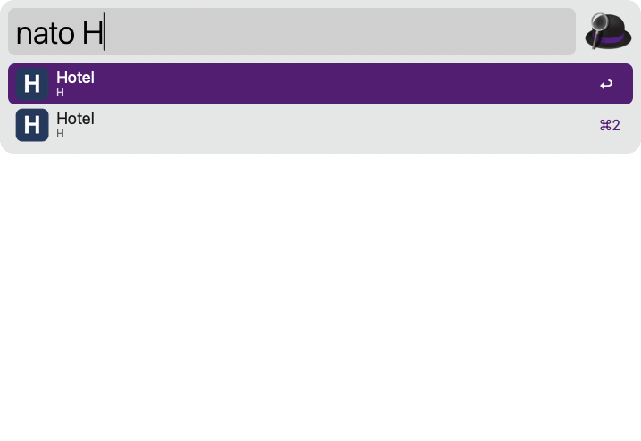
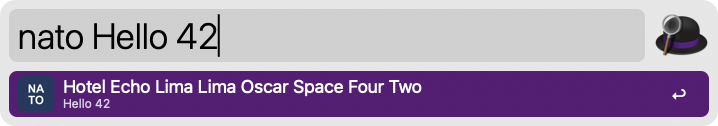
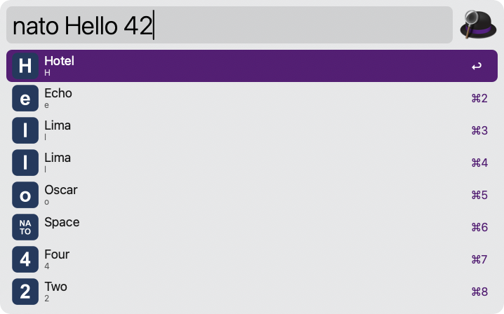

# NATO Spell

## Usage

Spell text out in the NATO phonetic alphabet via the `nato` keyword.



* <kbd>↩</kbd> Copy the spelling.
* <kbd>⌘</kbd><kbd>↩</kbd> Copy with case marked: `hotel INDIA`.
* <kbd>⌥</kbd><kbd>↩</kbd> Copy one character per line: `H – Hotel`.
* <kbd>⌘</kbd><kbd>L</kbd> Show in Large Type.

Configure the Hotkey to spell out selected text from any application.

Choose between a single result, one result per character, or both in the Workflow's Configuration.





Built with the help of Claude Code, an AI coding tool, and tested by hand.

## Install

Download `NATO.alfredworkflow` from Releases and double-click. No runtime dependencies: the script filter runs on macOS's built-in JavaScript for Automation.

## Contributing

PR titles follow [Conventional Commits](https://www.conventionalcommits.org) and become the squash commit. [release-please](https://github.com/googleapis/release-please) keeps a release PR open with the changelog and next version; merging it tags the release and attaches the built `.alfredworkflow`.

## Build

```bash
make alfredworkflow   # bundle
scripts/capture.sh    # regenerate README images from the installed workflow
```
